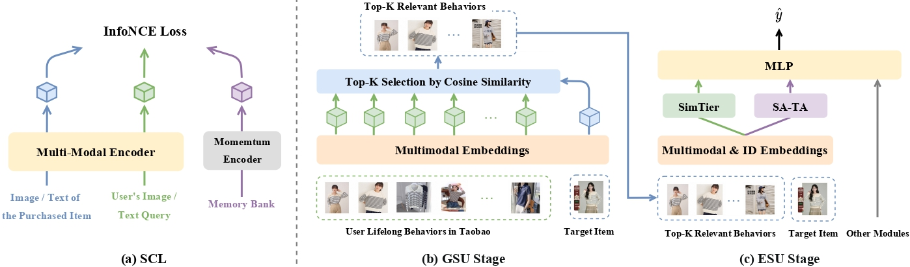

<h1 align='center'>MUSE: A Simple Yet Effective Multimodal Search-Based Framework for Lifelong User Interest Modeling</h1>

<p align="center">
  <a href="https://arxiv.org/abs/2512.07216"></a>
  <a href="https://taobao-mm.github.io/"></a>
  <a href="https://huggingface.co/datasets/TaoBao-MM/Taobao-MM/tree/main"></a>
</p>

<p align="center">
    <a href="#overview">Overview</a> |
    <a href="#set-up-environment">Set Up Environment</a> |
    <a href="#prepare-dataset">Prepare Dataset</a> |
    <a href="#run-experiments">Run Experiments</a> |
    <a href="#citation">Citation</a>
</p>

This is the official pytorch implementation of paper "MUSE: A Simple Yet Effective Multimodal Search-Based Framework for Lifelong User Interest Modeling". MUSE framework targets industrial-scale recommendation scenarios that require modeling lifelong user interests through ultra-long behavior sequences and rich multimodal item content. **MUSE has been deployed in Taobao display advertising system since mid-2025, demonstrating significant improvements during online service.**

## Overview

<div align="center">
  
</div>

**Overview of MUSE.** (a) Multimodal item embeddings are pre-trained via **Semantic-aware Contrastive Learning (SCL)**. In the recommendation phase, (b) the GSU stage efficiently retrieves the top-𝐾 behaviors most relevant to the target item from the user’s lifelong history using **lightweight multimodal cosine similarity**, drastically reducing the sequence length for downstream processing. (c) The ESU stage models fine-grained user interests through two components: the **SimTier** module compresses multimodal similarity sequences into histograms, while the **Semantic-Aware Target Attention (SA-TA)** module enriches ID-based attention with semantic guidance to produce the final lifelong user interest representation.

## Set Up Environment

Our project relies on `Python 3.10.19`. First, you need to ensure that `pytorch` of version comaparbale to `2.6.0` is installed (may be backward compatible). Then install other required dependencies from `requirements.txt`.

```bash
pip install -r requirements.txt
```

## Prepare Dataset

To reproduce the results presented in Table 7 ("Open-source-1k") of the paper, the [TAOBAO-MM](https://taobao-mm.github.io/) dataset is required. TAOBAO-MM now is publicly available on [🤗HuggingFace](https://huggingface.co/datasets/TaoBao-MM/Taobao-MM). After installing the `huggingface_hub` package via `pip install huggingface_hub`, you can download the dataset directly using the following command:
```
huggingface-cli download --repo-type=dataset TaoBao-MM/Taobao-MM --local-dir your/local/path
```
The complete dataset occupies 139 GB. For more details about the dataset, please refer to the [official dataset website](https://taobao-mm.github.io/) or the [huggingface repository](https://huggingface.co/datasets/TaoBao-MM/Taobao-MM).

In the `./utils/muse_dataset`, we implement the dataset class to load the training and test samples of TAOBAO-MM. We primarily use the following feature fields:

```python
# In line 10 of `trainer.py`

FEATURE_BLOCKS = {
    # non-sequential attributes of target item (ad)
    # "205" is the item ID
    # "205_c" is the item scl embedding
    "ad": ["205", "206", "213", "214", "205_c"],

    # non-sequential attributes of user
    # "129_1" is the user ID
    "user": ["129_1", "130_1", "130_2", "130_3", "130_4", "130_5"],

    # sequential features of user lifelong behavior, each is a list of length 1000
    # "150_2_180" is item ID list
    # "151_2_180" is item category list
    # "150_2_180_c" is item scl embedding list
    "uni_seq_fn": ["150_2_180", "151_2_180", "150_2_180_c"],

    # sequential features of user recent behavior, each is a list of length 50
    # obtained by truncating the long sequence from the newer end
    "short_seq_fn": ["150_1_180", "151_1_180", "150_1_180_c"]
}
```

Apart from the multimodal embeddings, all features are represented as discrete IDs, such as `-58759430334327705`. For each feature field, we first compute the number of unique IDs to determine the vocabulary size (ID_SIZE), then map the original IDs to consecutive integers in the range `[0, ID_SIZE]`. We implement static embeddings using `torch.nn.Embedding`, with the remapped integer IDs serving as input indices. It is important to note that this static embedding implementation differs from the one used in production, which may involve dynamic embeddings.

📰 **[2026/01/12] We now provide a [notebook](https://github.com/alimama-tech/MUSE/blob/main/data_preprocess.ipynb) as the data processing pipeline.**

## Run Experiments
To reproduce the experiments, replace the configuration file in the bash script and run it.
```bash
bash script/run_exp.sh
```
The code we currently provide includes implementations of MUSE, SIM-hard, and SIM-soft.

The configuration files for the experiments are located in the `config` directory. Below, we describe the key configuration parameters.

|Configuration|Type|Description|
|---|---|---|
|train_data_path|Path|Path to the training data.|
|test_data_path|Path|Path to the test data.
|feature_map_path|Path|Directory containing feature maps and SCL embedding tables.|
|dense_lr|Float|Learning rate for the dense components of the model (e.g., DNN layers).|
|sparse_lr|Float|Learning rate of the sparse part of the model (embeddings).|
|keep_top|Int|Top-K of GSU.|
|item_id_p90|Bool|If `true`, uses a simplified item ID vocabulary of size 35M, covering 90% of user historical interactions and 100% of target items; otherwise, uses the full vocabulary of 243M entries.|
|scl_emb_p90|Bool|If `true`, uses a simplified SCL embedding table of size 35M (same coverage as above); currently, only the simplified version is supported.|
|feature_map_on_cuda|Bool|If `true`, ID remapping is performed on GPU; otherwise, it is executed on CPU.|
|scl_emb_on_cuda|Bool|If `true`, SCL embedding lookups are performed on GPU; otherwise, they are carried out on CPU.|

Our training code supports distributed data-parallel training using PyTorch’s `DistributedDataParallel (DDP)`. The training and test datasets are partitioned into 160 and 48 shards, respectively, to facilitate efficient data loading. To ensure balanced workload distribution across devices, **we strongly recommend using 1, 2, 4, or 8 GPUs**. With 8 GPUs, a full training and evaluation cycle can be completed within one hour.

The CUDA memory overhead during training primarily arises from three sources:
1. Memory consumed by the embedding layers and their associated gradients during backpropagation;
2. Memory used to store the feature map;
3. Memory required for the SCL embedding table.

When modeling users’ long-term historical interaction sequences, the number of unique items can be very large, up to 243 million. Allocating an embedding table for all 243 million items would alone require over 30 GB of CUDA memory. However, many of these item IDs appear only once or twice in the training data and contribute minimally to model performance. To reduce memory consumption without significant degradation in accuracy, we recommend using a simplified ID vocabulary that filters out low-frequency items (set `item_id_p90` to `true`). With this simplification, the per-GPU memory cost is reduced to approximately 16 GB.

For further GPU memory savings, you may set `scl_emb_on_cuda` to `false`, which moves SCL embedding lookups to CPU memory. Note that it will incur a moderate overhead in training speed.

## Citation

If you find our work useful for your research, please consider citing the paper:
```
@misc{wu2025musesimpleeffectivemultimodal,
      title={MUSE: A Simple Yet Effective Multimodal Search-Based Framework for Lifelong User Interest Modeling}, 
      author={Bin Wu and Feifan Yang and Zhangming Chan and Yu-Ran Gu and Jiawei Feng and Chao Yi and Xiang-Rong Sheng and Han Zhu and Jian Xu and Mang Ye and Bo Zheng},
      year={2025},
      eprint={2512.07216},
      archivePrefix={arXiv},
      primaryClass={cs.IR},
      url={https://arxiv.org/abs/2512.07216}, 
}
```

